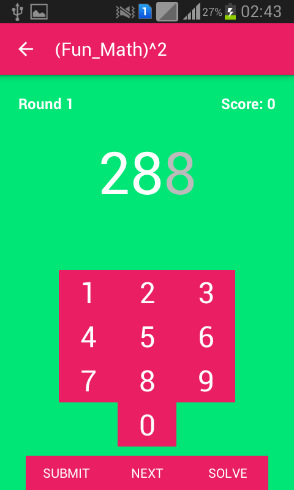

## Hackathon CSwithAndroid 2k16
 
## FunWithSquare

  
|  |   |
|-------------------------------------------|--------------------------------------------|
|  |   | 
   

This is Android Fun game to add digit and make a perfect Square Number and perfect cube and perfect fourth root  for a  Given prefix number.
 
* Rules of the Game: 
    (Fun_Math)^2 is a simple math game where user need to guess the correct length perfect 
    square,cube ,fourth root for a  given prefix. The prefix is n-1, where n is the actual 
    length of the perfect square ,cube and fourth root. 
    1.First you need to select the level like square ,cube and fourth root. 
 There are basically three rounds for each level: 
   * First Round: 
     User need to guess 5 different perfect squares of length 3 given a prefix of 2. 
     If user is able to guess the correct square then he wins and a message pops out,you win press next to continue 
     If he fails to guess then he loose and a message pops out,you loose press next to continue  
     For each correct answer you will get +5 and for wrong answer -2 score will deduct. 

  * Second Round: 
    Here the user need to guess 5 different perfect squares of length 4 given a prefix of length 3. 

  * Third Round: 
    Here the user need to guess 5 different perfect squares of length 5 given a prefix of length 4. 
    Entering Solve button at any stage leads to display of the appropriate perfect square. 
    
  *Before going to next round your score should be greater than 10 else you will have play for the same round.
 
  * And So on ...  , make Best your level. All the Best. :) 
 
   We use Data structure Redix Tree : 
     A radix tree is a compressed version of a trie.In a trie, on each edge you write a  
     single letter, while in a Patricia tree(or radix tree) we store whole words. 
     It takes less memory compared to trie node.
### Team Members (contribution in Hackathon 2K16)

* [Jitendra Singh](https://github.com/jsroyal) - Design & Implementation
* [Ajit Jain](https://github.com/ajit1515ajit) - Algorithm & Implemention
* [Prem Chand Saini ](https://github.com/pcsaini) - User interface 
* [K Naveen kumar](https://github.com/naveen) - Algorithm and Readme    

